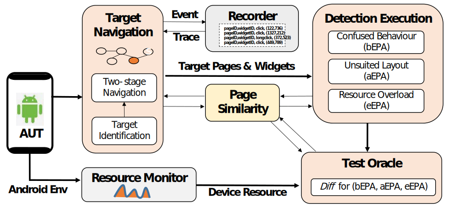

# EP-Detector: Automatic Detection of Error-prone Operation Anomalies in Android Applications

## Table of Contents

- [EP-Detector: Automatic Detection of Error-prone Operation Anomalies in Android Applications](#ep-detector-automatic-detection-of-error-prone-operation-anomalies-in-android-applications)
  - [Table of Contents](#table-of-contents)
  - [Error-prone Operation Anomaly(EPA)](#error-prone-operation-anomalyepa)
    - [EPA](#epa)
    - [Motivating Examples](#motivating-examples)
  - [Approach](#approach)
    - [Target Navigation](#target-navigation)
    - [Detection Execution](#detection-execution)
    - [Test Oracle](#test-oracle)
  - [Getting Started](#getting-started)
    - [Environment](#environment)
    - [Installation](#installation)
      - [1. Installing Appium (Version 1.22.3)](#1-installing-appium-version-1223)
      - [2. Setting Up ADB](#2-setting-up-adb)
      - [3. Cloning the GitHub Project](#3-cloning-the-github-project)
      - [4. Extending the appium-python-client](#4-extending-the-appium-python-client)
    - [Seamless Deployment](#seamless-deployment)
      - [1. Enabling USB Debugging on Android Device](#1-enabling-usb-debugging-on-android-device)
      - [2. Connecting the Android Device to Your Host via USB Cable](#2-connecting-the-android-device-to-your-host-via-usb-cable)
      - [3. Fine-Tuning Android Device Parameters](#3-fine-tuning-android-device-parameters)
      - [4.Initiating the Appium Service](#4initiating-the-appium-service)
    - [Usage](#usage)


## Error-prone Operation Anomaly(EPA)
### EPA
Error-prone Operation Anomaly (EPA) is a critical aspect in the design and interaction of Graphical User Interfaces (GUI) within Android applications. It refers to the propensity for misoperations caused by elements of the interface that are prone to errors, known as Error-prone GUI Elements (EPE). These anomalies are not mere trivialities but have profound implications for the functionality and user experience of an application.

As applications become more complex to meet the diverse and intricate demands of users, the likelihood of EPA occurrences has increased. For instance, Android's introduction of optional gesture systems since version 10.0, replacing traditional buttons with swipe gestures, has complicated user interactions. Such complexities can lead ordinary users to perform incorrect operations, often resulting from an unreasonable design of page elements.

The ramifications of EPAs are multifaceted and detrimental. Misoperations can lead to system freezes, crashes, and even security vulnerabilities. Furthermore, they can severely degrade the user experience, causing frustration and distrust in the application. The problem is exacerbated in mobile environments, where constraints such as limited screen size, CPU, RAM, and network resources increase the risk of misoperations.

Despite the glaring need to address this issue, there remains a lack of systematic study and precise detection of EPAs. The detection is especially challenging as EPAs can have diverse manifestations, and triggering them consistently is a complex task.

### Motivating Examples

This section motives our research with three error-prone user
events that occur in the same Android app. Figure 1 shows the
GUI of a well-known Chinese banking Android app, and illustrates
three irreversible error operations as follows.

EPA 1: When a user opens the app, she will be directed to the home page. As shown in the figure above (a), an advertisement dialog pops up on top of the actual home page. If the user wants to close the advertisement and visit the home page, she may find that the closing button is small and somewhat hidden (as shown in (a)-○1 in the figure above). This can result in accidentally pressing the wrong area, which redirects the user to the advertisement page instead.

EPA 2: When the user visits the main operation page and wants to use the three-finger swipe for screenshot provided by the Huawei Harmony to save the key page information (as shown in (b)-○1 in the figure above), the system may wrongly recognize it as a click due to the excessive force of the first finger. The click may lead to the bank scan function ((b)-○2 in the figure above), and the app navigates to the scan page. If it happens that a payment QR code appears in front of the camera ((b)-○4 in the figure above), the app will be redirected to the payment transfer page.

EPA 3: The user intends to visit the "My Payment" page (as shown in (c)-○1 in the figure above) to set the payment limit. However, if the page loading is stuck due to, for example, network delay, the user may assume it’s her operation fault and repeatedly click on the screen ((c)-○2 in the figure above). When the “My Payment” page eventually loads, these additional clicks may inadvertently trigger actions if there are buttons placed in the same position on the “My Payment” page, e.g., the payment scan button (as shown in (c)-○3 in the figure above). As a result, these unintended clicks lead the app to the payment scan and subsequently to the payment transfer page if a payment QR code is detected in front of the camera.

## Approach
Given an app under test, the EP-Detector detects the EPAs for each widget through the following three modules, as shown in Figure below. The Target Navigation module navigates to the target pages and widgets relying on the page & widget identification. To reduce cost, the Event Trace during the navigation is logged in the Recorder to guide new navigation. The target pages and widgets are then fed into the Detection Execution module for the detection of three typical types of EPAs. Finally, the Test Oracle module has an automated oracle to compute the Diff function . for the EPAs. In this process, both the change of environment 𝐸𝑛𝑣𝑠𝑖𝑚 and page similarity P𝑠𝑖𝑚 before and after user events are computed, where the system environment is collected by the Resource Monitor, and the $P_{𝑠𝑖𝑚}$ is used to determine whether a target page is obtained in Target Navigation and Detection Execution.



### Target Navigation
To identify and locate widgets with error-prone operations (e.g., buttons, text editors, sliders), the EP-Detector adopts a widget-exploration approach, deviating from the commonly used path-exploration approach in the majority of existing model-based GUI testing. In this process, the Target Navigation module incorporates a two-stage navigation.
-  1: Page Navigation :Simulate user actions according to the Recorder until reaching the target test page.
-  2: Widget Navigation：Navigate to the target widget on the given page, in order to test this widget.

### Detection Execution
Analyzing and recognizing user behaviors while operating widgets can be a complex and confusing task. In this scenario, we are primarily focusing on user gestures that might impact the operable widgets, guided by gesture-related Android classes like android.view.View, android.widget, android.view.GestureDetector, and MotionEvent.

Since detecting all the investigated behaviors for each widget can be cost-consuming, redundant and low-value behaviors are filtered using the following strategies:

Filtering Strategies
- **Directional Behaviors:** Only the most commonly used direction is preserved, e.g., upSwipe is preserved, and downSwipe is filtered out.
- **Similar Behaviors:** Only the representative one is preserved, e.g., swipe is preserved, and fling is filtered out.
- **System-specific and Rarely Used Behaviors:** Behaviors like knuckle tap and twoFingerDoubleClick are omitted.
###  Test Oracle
EP-Detector supports an automated test oracle, where the function Diff (Eq. 3 in §4, §5.2.3) is computed using different strategies for the three types of EPAs.

- In the detection of bEPA, given current state 𝑠 and a pair of confused behaviours (𝑒1 and 𝑒2) from the same behaviour group in Table 2, the test oracle aims to determine whether `Diff (𝑠, 𝛿 (𝑠, 𝑒1))) > 𝜏 & Diff (𝑠, 𝛿 (𝑠, 𝑒2))) > 𝜏` holds.
- In the detection of aEPA, given current state 𝑠 and a pair of operations on safe area §5.3.3 (𝑒1 and 𝑒2), the test oracle aims to determine whether `Diff (𝛿 (𝑠, 𝑒1), 𝛿 (𝑠, 𝑒2)) > 𝜏` holds.
- In the detection of eEPA, the test oracle contains two parts:
  1. Heavier overload. Assuming 𝑠 and 𝑠′ are the states before and after𝑐&𝑟 operations respectively, the oracle determines whether `Diff (𝑠.𝑒𝑛𝑣, 𝑠′.𝑒𝑛𝑣) > 𝜏` holds.
  2. Unintended misoperation. Through page identification, the test oracle first checks if a page jump from page A to page B occurs when 𝑐&𝑟 operations are performed. Then assuming 𝑠 and 𝑠′ are the states before and after operating on page B respectively, the oracle determines whether `Diff (𝑠, 𝑠′) > 𝜏` holds.

Except for the detection of heavier overload, the 𝛼 and 𝛽 in Diff are determined in a dynamic way, where the P𝑠𝑖𝑚 and 𝐸𝑛𝑣𝑠𝑖𝑚 are first computed and then the two coefficients are determined.

## Getting Started

### Environment
- Operating System: Windows 10/11
- Android Device Version: Android 10~13
- Appium Version: v1.22.3 (See [Appium Installation Guide](http://appium.io/docs/en/2.0/))
- Android Debug Bridge (ADB) Version: 1.0.41
- Python Version: 3.8
### Installation
#### 1. Installing Appium (Version 1.22.3)

Find the complete guide to installing Appium [here](http://appium.io/docs/en/2.0/quickstart/install/).
#### 2. Setting Up ADB
ADB can be smoothly installed using either Google's standalone platform-tools or via Android Studio. Find the full instructions [here](https://source.android.google.cn/docs/setup/build/adb).
#### 3. Cloning the GitHub Project
Start by cloning the Python version of EP-Detector from GitHub using the following command:
```shell
git clone https://github.com/WordDealer/EP-Detector

```
We recommend using a Python 3.8 virtual environment to run the code, especially since the appium-python-client's source code will be custom modified for simulating user actions. Below are the essential Python packages required:

| Python Package     | Version |
|--------------------|---------|
| appium-python-client | 2.1.0   |
| numpy               | 1.23.5  |
| urllib3             | 1.26.15 |
| opencv-python       | 4.5.4.60|

A suggested practice is to use a conda virtual environment with the following steps:

```shell
conda create --name EPDetector python=3.8
conda activate EPDetector
conda install -c conda-forge appium-python-client==2.1.0
conda install -c conda-forge numpy==1.23.5
conda install -c conda-forge urllib3==1.26.15
conda install -c conda-forge opencv-python==4.5.4.60
```
#### 4. Extending the appium-python-client
To create a customized user experience, replace the existing `action_helpers.py` file with a newly modified version, [here](http://github.com/EP-Detector/EP-Detector/Appium_externed/action_helpers.py). The path is conveniently located at `python-client/appium/webdriver/extensions/`(conda虚拟环境或者python环境下的子路径).
### Seamless Deployment
#### 1. Enabling USB Debugging on Android Device
As an example, for OPPO Reno 5K, Android 13, you should enable these options:

- Developer Options
- Screen Stays Awake While Charging
- USB Debugging

And disable:

- Permission Monitoring

#### 2. Connecting the Android Device to Your Host via USB Cable
Once the environment is configured, connect the Android device to the host with a USB cable and use the command `adb devices` to list all connected devices and emulators.
```shell
$ adb devices  
List of devices attached  
3102847529001WC device
```
#### 3. Fine-Tuning Android Device Parameters
You'll need to modify the Main.py and MainForEnv.py files to change the device name and Android version to match your specific hardware.
```python
    desc['deviceName']='127.0.0.1:3102847529001WC'
    desc['platformVersion']='13'
```
#### 4.Initiating the Appium Service
You can easily start the Appium service with this simple command:
```
$ appium
[Appium] Welcome to Appium v1.22.3
[Appium] Appium REST http interface listener started on 0.0.0.0:4723
```
### Usage
Before diving into EP-Detector, ensure that every single step in the Installation and Deployment phases has been carefully followed.

Within the project, you'll find two main scripts that act as gateways for detecting aEPAs, bEPAs, and eEPAs. They function as follows:
| Script          | Description                               |
|-----------------|-------------------------------------------|
| Main.py         | Guides the detection of aEPAs and bEPAs.  |
| MainForEnvs.py  | Focused on eEPAs detection.               |

For detecting aEPAs and bEPAs, execute:
```shell
cd EP-Detector
conda activate EPDetector
python Main.py
```
For detecting eEPAs, follow:
```shell
cd EP-Detector
conda activate EPDetector
python MainForEnvs.py
```
